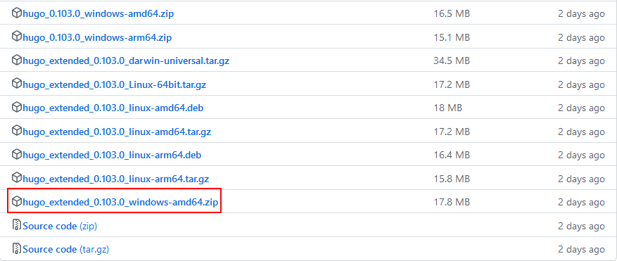
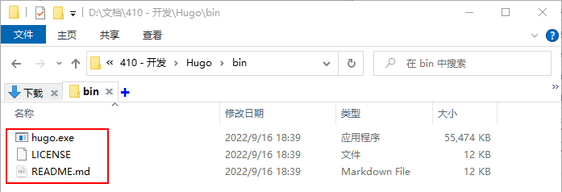
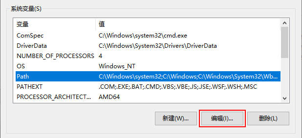
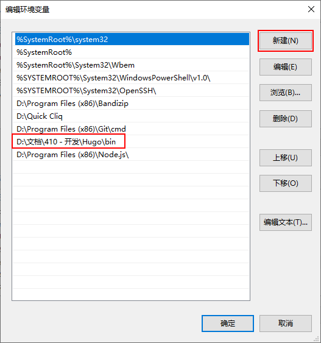
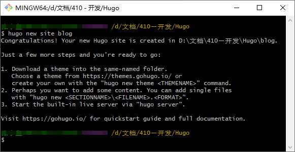
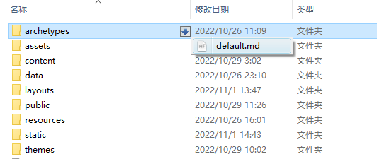
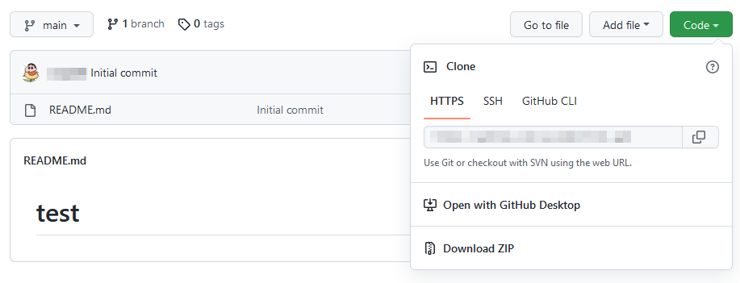
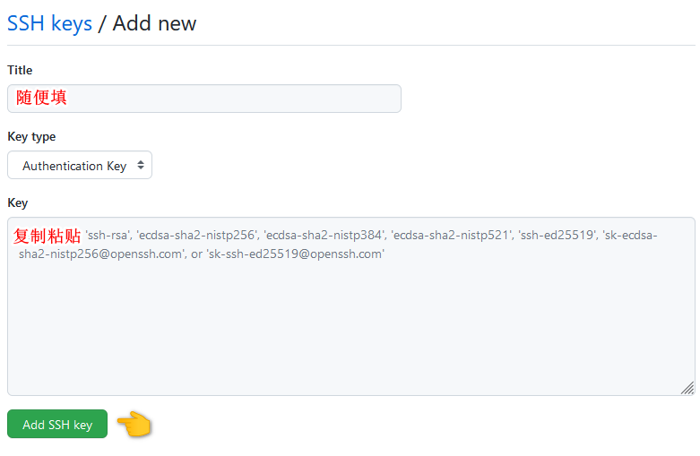
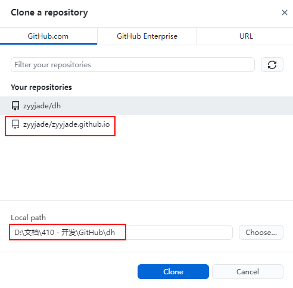
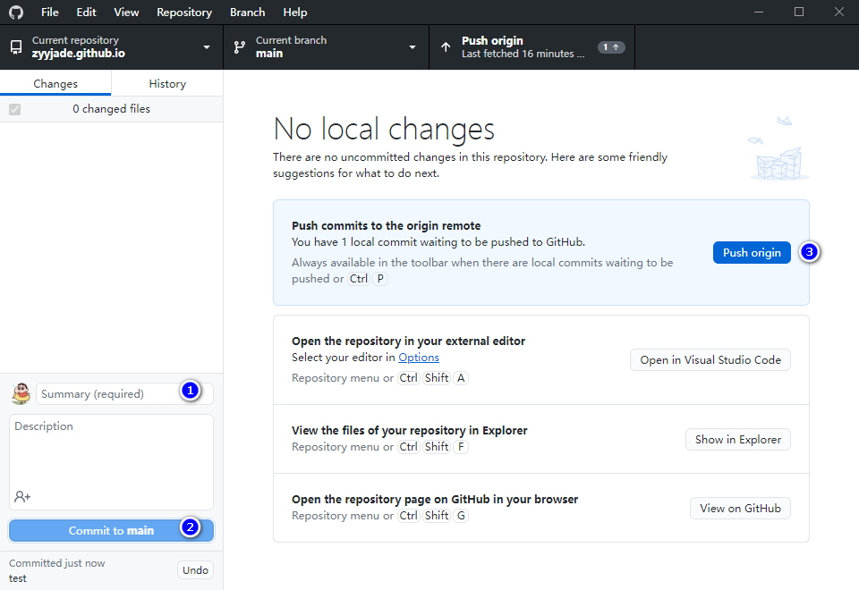

# 简单易上手！非程序猿带你搭建免费个人博客

<!--more-->

有人可能会问，你为什么要自己搭建博客？明明有公众号、简书、知乎那么多的平台，何必折腾呢？

在回答这个问题之前，我希望你可以回想一下当遇到一些问题时，是不是会下意识地打开百度？然后过了很长一段时间，当你再碰到类似的问题，你是不是又打开百度再搜索？如此循环往复，时间和精力都被浪费掉了。

但是，如果我拥有自己的知识库，将遇到过的问题记录下来，那么下次再遇到的时候，我只要搜索一下，不就能立刻得到我想要的答案了嘛！😋😋😋

所以，我希望的是能够建立自己个人的知识库，它具有我想要的功能，可以最大限度地自定义我的内容，而自建博客网站恰好是实现这一目的的方式。

搭建博客难吗？说难也难，因为你正在接触一件新事物，人们容易对新事物产生不适感。说容易也很容易，不会代码，不是程序员，只要会下载软件和打字，跟着下面的步骤，你就能自己搭建一个静态博客。

## 安装工具

静态网站非常适合专注于内容的网站，通过静态网站生成器，你可以很简单地构建一个静态博客。常见的静态网站生成器有 [Hexo](https://hexo.io/zh-cn/)、[Hugo](https://gohugo.io/)、[Jekyll](http://jekyllrb.com/) 等，本文以 Hugo 进行操作。

[Hugo](https://gohugo.io/) 是 Go 编写的静态网站生成器，速度快，易用，可配置，只需要几分之一秒就可以渲染一个经典的中型网站，非常适合博客，文档等网站的生成。

在开始搭建网站之前，建议安装 [Git 工具](https://git-scm.com/)，它是一个版本管理控制系统软件，可以记录代码修改的每一个环节，就好比我们玩游戏存档。如果你打不开前面的链接，你还可以下载[国内镜像](https://npm.taobao.org/mirrors/git-for-windows/v2.22.0.windows.1/Git-2.22.0-64-bit.exe)版本。

Hugo 的安装非常简单，只需要前往 [Hugo Releases](https://github.com/gohugoio/hugo/releases) 下载你所使用的操作系统的最新版本的二进制文件即可，推荐下载 `Hugo Extended` 版本，因为部分主题的一些特性需要将 SCSS 转换为 CSS，使用该版本将获得更好的体验。下面的操作步骤以 Windows 10 64bit 为例。



接着新建一个「 hugo 」文件夹，在它下面再新建「 bin 」文件夹，然后将下载的文件解压到新建的「 bin 」文件夹中。



同时还要将 Hugo 添加到环境变量中，如果缺少这一步，Hugo 将无法运行。





> 环境变量位于右键单击「 我的电脑 -> 属性 -> 高级 -> 环境变量 」，或者按住 `win+R` 进入设置，选择「 系统 -> 关于 -> 高级系统设置 -> 高级  -> 环境变量 」。

最后，你可以按住 `win+R`，输入 `cmd` ，进入命令提示符页面，输入 `hugo version` 即可验证是否成功。如果出现版本号，说明环境变量配置成功。

## 创建网站

前一步完成后，我们打开刚刚新建的「 Hugo 」文件夹，然后在空白处右键单击 `Git Bash Here` ，并输入以下命令：

```bash
hugo new site blog
```



以上命令将会创建一个名为「 blog 」的文件夹，该文件夹存储着你的博客站点数据，你可以将 blog 改为其它单词，创建属于自己的站点，这也是 Hugo 的根目录。

## 主题配置

主题是什么？你可以理解为网页的设计，就像我们穿衣服一样，你需要给你的博客打扮打扮，你可以前往 [Hugo 主题网站](https://themes.gohugo.io/)选择你喜欢的主题。下面以 [DoIt](https://hugodoit.pages.dev/zh-cn/) 主题进行说明。

在 Hugo 根目录，右键单击 `Git Bash Here` ，依次输入以下命令：

```bash
git init
git submodule add https://github.com/HEIGE-PCloud/DoIt.git themes/DoIt
```

☕☕☕ 等待几分钟，主题就安装完成啦~ (～￣▽￣)～ 

接着将 `...\themes\DoIt\exampleSite`内的 `config.toml` 复制到 Hugo 根目录，覆盖掉原先的 `config.toml`，并打开复制后的文件，将 `themesDir = "../.."` 更改为 `themesDir = "themes"`。

然后在 Hugo 根目录，右键单击 `Git Bash Here` ，输入以下任一命令，就可以进入[本地服务器](http://localhost:1313)预览你的网页了。

```bash
hugo server               # 本地预览命令
hugo server -D            # 支持预览草稿的本地预览命令
hugo serve -e production  # 支持启用评论系统和CDN等的本地预览命令
```

由于 Hugo 支持实时预览修改，即可以一边主题配置文件，一边在网页预览效果，所以你可以开启本地预览命令，参照 [DoIt 主题使用文档](https://hugodoit.pages.dev/zh-cn/theme-documentation-basics/)配置你自己的网页。

配置主题相当于开启和关闭功能，就好像我们日常使用的 APP，里面有很多功能，但并不是所有的功能你都需要，你可以结合自己的需求有选择地在主页面开启和隐藏某些功能，你只要打开刚刚复制的 `config.toml`修改即可。

## 发表文章

在发表文章之前，我们需要了解一下`Front matter` ，它最直观的体现为 Markdown 文件最上方以 `---` 分隔的区域，用于指定网页页面的属性（变量），如标题、发布时间、分类、标签等。

你可以选取所需要的参数，对 `Front matter`进行修改，这样当我们创建页面的时候，就不需要逐一增设参数，而只需填写变量内容即可。



打开 Hugo 根目录下的  `...\archetypes\default.md`，结合自己的需求修改内容，以下是 DoIt 主题的 `Front Matter`，提供给大家参考：

```markdown
---
title: "我的第一篇文章"
subtitle: ""
date: 2020-03-04T15:58:26+08:00
lastmod: 2020-03-04T15:58:26+08:00
draft: true
authors: []
description: ""
license: ""
images: []

tags: []
categories: []
series: []
series_weight: 1
seriesNavigation: true
featuredImage: ""
featuredImagePreview:: ""

hiddenFromHomePage: false
hiddenFromSearch: false
twemoji: false
lightgallery: true
ruby: true
fraction: true
fontawesome: true
linkToMarkdown: true
linkToSource: false
linkToEdit: false
linkToReport: false
rssFullText: false
license: ''

toc:
  enable: true
  auto: true
code:
  copy: true
  # ...
table:
  sort: true
  # ...
math:
  enable: true
  # ...
mapbox:
  accessToken: ""
  # ...
share:
  enable: true
  # ...
comment:
  enable: true
  # ...
library:
  css:
    # someCSS = "some.css"
    # 位于 "assets/"
    # 或者
    # someCSS = "https://cdn.example.com/some.css"
  js:
    # someJS = "some.js"
    # 位于 "assets/"
    # 或者
    # someJS = "https://cdn.example.com/some.js"
seo:
  images: []
  # ...
outdatedArticleReminder:
  enable: false
  # ...
sponsor:
  enable: false
  # ...
related:
  enable: false
  count: 5
---
```

然后就可以开始发布文章啦，在 Hugo 根目录右键单击 `Git Bash Here` ，依次输入以下任一命令：

```bash
hugo new posts/first/index.md
hugo new posts/first.md
```

这两条命令的区别在于，前者创建了一个页面资源包，通过修改 Typora 图像的偏好设置，可以直接将本地图片复制到该文件夹，并引用其相对路径。后者则是直接创建一个 `posts` 页面，图片可以根据自己的需求放在「 assets 」或「 static 」文件夹，引用其相对路径，或直接上传到图床，引用其绝对路径。

需要注意的是，图片的命名必须取英文字符，如 `pic.png`，如果命名为中文字符或有空格，图片将无法正常显示，如`图片.png`。

## 部署博客

### 注册账号

Are you ready？你准备把你做好的网页发给你朋友看了吗？如果你准备好了，就开始吧！

首先，你需要有一个 [GitHub](https://github.com/) 账号，如果你有，就需要登录并创建一个新的仓库；如果你没有，就跟着下面的步骤来操作吧。

| 步骤 | 内容          | 要点                                                         |
| :--: | ------------- | ------------------------------------------------------------ |
|  1   | 账号注册/登录 | 未注册：进入[官网](https://github.com/)，点击 `Sign up` ，根据提示注册账号；<br>已注册：点击右上角的 `Sign in` ，登录 GitHub 。 |
|  2   | 创建新仓库    | 点击头像，选择  `Your repositories` 进入仓库； <br>点击绿色按钮 `New` 新建仓库； <br>填写 `Repository name *` ; <br>勾选 `Add a README file` ； <br>点击绿色按钮 `Create Repository` 创建新仓库。 |

关于 `Repository name *`，GitHub 默认提供 `.github.io` 域名给用户使用，且具有唯一性。如果你想生成的是主域名，如 https://owner.github.io，则填写 `owner.github.io`，其中 `owner` 是你注册时的用户名。如果你想生成的是子域名，如 https://owner.github.io/blog，则填写 `blog` 即可，同时记得修改 Hugo 配置文件。

```toml
# 主域名
baseURL = "https://owner.github.io/"
# 子域名
baseURL = "https://owner.github.io/blog"
```

仓库名可进入仓库的「 Setting -> General -> Repository name -> Rename 」修改。

### 生成网站

一般而言，Hugo 在部署到 GitHub 之前需要先生成静态网站文件，然后再将生成的静态网站文件「 Public 」上传到 GitHub 仓库。

在 Hugo 根目录，右键单击 `Git bash here`，输入以下任一命令构建网站：

```bash
hugo 
hugo -F --cleanDestinationDir
```

`hugo` 会在 「 public 」文件夹生成静态网站资源，如果下次网站有修改，需要删除该文件夹，再重新执行该命令，因为该命令只会往里面添加内容，不会删除外部已删除而「 public 」仍存在的文件。

`hugo -F --cleanDestinationDir` 则会从静态目录中找不到的目标中删除文件，表示每次生成的「 public 」都是全新的，会覆盖原来的。

关于部署到 GitHub 的方式，如果你想一劳永逸，可以使用 [GitHub 桌面版](https://desktop.github.com/)直接上传本地网站代码到 GitHub 仓库，阅读「 软件部署 」部分即可。如果不想再下载多一个软件占用本地空间，可以拉到「 命令部署 」部分进行操作。

### 命令部署

我们要通过 Git 将本地网站代码传输到 GitHub 仓库，需要利用到 GitHub 仓库的 Git 地址。Git 地址有两种形式，一种是 HTTPS 地址，如 `https://github.com/owner/repo.git`，另一种是 SSL 地址，如 `git@github.com:owner/repo.git`。



由于 GitHub 的特性，使用 HTTPS 地址，你每次通过 Git 提交的时候，都需要输入用户名和用户密码，而使用 SSL 地址则无需这样繁琐的操作。如果你使用的是 HTTPS 地址，则在 Hugo 根目录执行以下命令。

```bash
cd public
git init
git add .
git commit -m "message"
git branch -M main 
git remote add origin https://github.com/owner/repo.git
git push -u origin main
```

如果你使用的是 SSH 地址，则需要按如下步骤获取你的密钥。首先，在桌面右键选择 `Git Bash here`，执行以下命令，自行替换引号内的相应字段。

```bash
git config --global user.name "注册时的用户名"
git config --global user.email  "注册时的用户邮箱号"
ssh-keygen -t rsa -C "注册时的用户邮箱号"
```

此时会询问是否需要密码，不需要直接继续按三次回车即可，然后可以执行以下命令，获取你生成的密钥。

```bash
cd ~/.ssh
cat id_rsa.pub
```

鼠标选中后右键选择 `Copy` ，回到 GitHub 的页面，点击「 头像 -> Settings -> SSH and GPG keys -> New SSH key 」，将复制的内容粘贴到 Key 位置。



配置完成后，你可以通过 `ssh -T git@github.com` 测试是否成功配置 SSH Key。然后回到 Hugo 根目录，右键单击 `Git bash here`，执行以下命令部署网站。

```bash
cd public
git init
git add .
git commit -m "message"
git branch -M main 
git remote add origin git@github.com:owner/repo.git
git push -u origin main
```

接下来进入仓库，点击「 Settings -> Pages -> GitHub Pages 」，就可以复制你的域名分享给朋友啦！👏👏👏

如果你没有看到 GitHub Pages 有地址，你需要在 Branch 选择 main ，然后点保存，稍等片刻后刷新就会出现。

### 软件部署

[GitHub 桌面版](https://desktop.github.com/)的操作很傻瓜式，直接复制粘贴替换即可，不需要记很多命令，也不需要申请 SSH 密钥等一系列操作，缺点就是会占用本地空间。

下载安装后，进入页面登录后选择 `Clone a repository`，选择刚刚新建的仓库，选择 `Local Path` 用于放置博客 `public` 的内容。



接着，将 Hugo 根目录下的「 Public 」中的所有内容复制到刚刚的 `Local Path` 中，它就会自动出现在 GitHub 桌面版的界面中，然后按照下图指示操作就会自动部署到 GitHub 仓库中。



最后我们回到 GitHub 仓库界面，选择「 Setting -> Pages 」就可以获取我们的域名啦，并且可以发送给朋友看啦！👏👏👏

💡 TIP：每次构建网站前，建议把「 Public 」整个文件夹删掉，然后再执行 `Hugo` 命令，不然可能会出现 Bug；或直接执行 `hugo -F --cleanDestinationDir` 命令，无需删除该文件夹。

## 参考内容

- [Hugo 文档](https://gohugo.io/)
- [DoIt 主题文档](https://hugodoit.pages.dev/zh-cn/theme-documentation-basics/)

