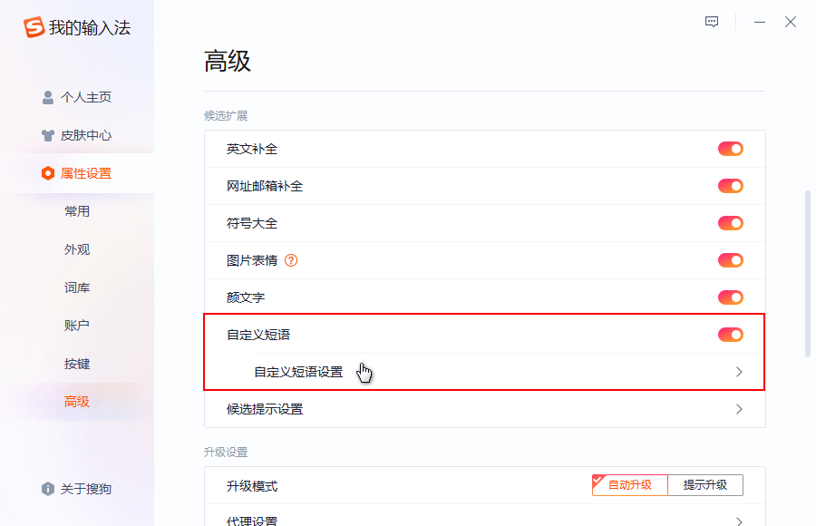
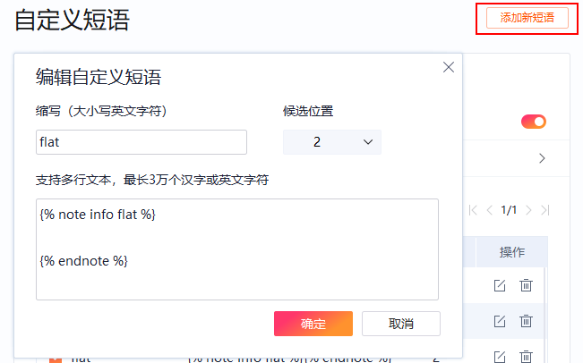

# 速查！Hugo Shortcodes 语法手册

<!--more-->

Markdown 的内容格式虽然简单，但是有时它也不尽如人意，在很多方面都无法很好地支持，这时内容编辑者就需要使用纯 HTML 来扩展可能性，这与 Markdown 语法的优美简洁相矛盾。

为了尽可能避免使用 HTML 以保持内容简洁，Hugo 创建了 Shortcodes 来规避这些限制。`Shortcodes` 是内容文件中的一个简单片段，可以生成合理的 HTML 代码，并且符合 Markdown 的设计哲学。在站点生成时，Hugo Shortcodes 将轻松合并到更改中，避免了可能复杂的搜索和替换操作。

通常无需记忆具体的语法，只要知道每个参数所代表的意义即可，你可以借助[搜狗拼音输入法](https://shurufa.sogou.com/?r=mac&t=pinyin)的自定义短语功能，将预设好参数的标签插件添加新短语，从而通过缩写实现快捷输入。





## 内置简码

Hugo 附带了一组预定义的 Shortcodes，实现了一些常见的用法，以保持 Markdown 内容简洁。更具体的内容参数请阅读 [Hugo Shortcodes 文档](https://gohugo.io/content-management/shortcodes/)，下表仅为简单使用的短代码简表。

|   作用   | 语法                                                         |
| :------: | ------------------------------------------------------------ |
|   图片   | ``         |
|   gist   | ``                            |
| 语法高亮 | ``……``       |
| 前置参数 | ``                     |
| 页面链接 | 用法1：`[文章标题]()`<br>用法2：`[文章标题]()` |
|   推特   | ``                |
| YouTube  | 用法1：``<br>用法2：`` |


## 扩展简码

[DoIt](https://hugodoit.pages.dev/zh-cn/theme-documentation-extended-shortcodes/) 主题在 Hugo 内置的 Shortcodes 的基础上提供多个扩展的 Shortcodes，支持 Markdown 或 HTML 格式。更具体的内容参数请阅读 [DoIt 扩展 Shortcodes 使用文档](https://hugodoit.pages.dev/zh-cn/theme-documentation-extended-shortcodes/)，下表仅为简单使用的短代码简表。

|    作用    | 语法                                                         |
| :--------: | ------------------------------------------------------------ |
| 自定义样式 | `` ……``         |
|    链接    | `` |
|    图片    | `` |
|  提示横幅  | ``……``<br>其中横幅类型可选：note、abstract、info、tip、success、question、warning、failure、danger、bug、example、quote |
|  数据图表  | 用法1：``……``<br>用法2：``……``<br>具体请参考 [mermaid](https://mermaidjs.github.io/) 和 [Echarts](https://echarts.apache.org/zh/index.html) |
|    地图    | ``                  |
|    音乐    | 用法1：``<br>用法2：``<br>用法3：``<br>其中音乐平台可选：netease、tecent、kugou、xiami、baidu；音乐类型可选：song、playlist、album、search、artist |
|  bilibili  | ``                            |
|  打字动画  | 简单打字动画：``……``<br><br>代码打字动画：``…… ``<br>段落打字动画：``…… `` |
| Javascript | ``……``                  |
|    友链    | ``             |
|  项目展示  | `` |
|  数学公式  | ``……``                      |

## 更多简码

这部分是我收集的自定义简码，需要在 `~/layouts/shortcodes/` 下创建 `name.html` 文件后使用，目前仅在 DoIt 主题使用过，不一定适用于全部主题，请视情况使用。

### 文字位置

这个简码的功能是设定文字的位置（居左、居中、居右、两端对齐等等），支持的样式基于 CSS 语法。你需要在 `~/layouts/shortcodes/` 下创建 `align.html` 文件，其内容如下：

```html
<p style="text-align:{{ index .Params 0 }}">{{ index .Params 1 | markdownify }}</p>
```

使用时只需要把需要改变位置的文字填在双引号处即可，示例源码如下。

```markdown



```

## 参考内容


- [Hugo Shortcodes](https://gohugo.io/content-management/shortcodes/)
- [DoIt 扩展 Shortcodes](https://hugodoit.pages.dev/zh-cn/theme-documentation-extended-shortcodes/)
- [自定义 Hugo Shortcodes 简码](https://guanqr.com/tech/website/hugo-shortcodes-customization/)

