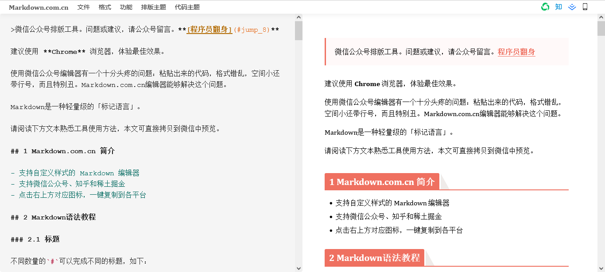

# 超实用！写文章必备的 Markdown 速查手册

<!--more-->

> Markdown 格式的首要设计目标是更具可读性，最初的想法是 Markdown 格式的文档应当以纯文本形式发布，而不会看起来像被标签或格式说明所标记。虽然 Markdown 的语法受到几种现有的文本到 HTML 转换工具的影响，但 Markdown 语法的最大灵感来源是纯文本电子邮件的格式。
>
> —— John Gruber

Markdown 是一种轻量级标记语言，创始人为约翰 · 格鲁伯（John Gruber）。 它允许人们使用易读易写的纯文本格式编写文档，然后转换成有效的 XHTML 或者 HTML 文档。这种语言吸收了很多在电子邮件中已有的纯文本标记的特性。

由于 Markdown 的轻量化、易读易写特性，并且对于图片、图表、数学公式都有支持，许多网站都广泛使用 Markdown 来撰写帮助文档或用于论坛上发表消息。

通俗来讲，Markdown 是一种文本书写方式，通过编辑器将文本生成网页，就好比 Office，你可以通过 Word 将文本排版成文，通过 Excel 将文本构图成表，通过 PPT 将文本演示表达。



## 编辑工具


|  类型  | 工具                                                         |
| :----: | ------------------------------------------------------------ |
| 编辑器 | 1️⃣ OSX：[Typora](https://www.typora.io/)；[Byword](http://bywordapp.com/)；[iA Writer](http://ia.net/writer/)；[Mouapp](http://mouapp.com/)；[TEXTS](http://www.texts.io/)；[Kobito](http://kobito.qiita.com/)<br>2️⃣ Windows：[Typora](https://www.typora.io/)；[MarkdownPad](http://markdownpad.com/)；[TEXTS](http://www.texts.io/)<br>3️⃣ iOS：[Byword](http://bywordapp.com/)；[iA Writer](http://ia.net/writer/)<br>4️⃣ 通用文字编辑器：[Sublime Text](http://www.sublimetext.com/)；[plasticboy/vim-markdown](plasticboy/vim-markdown)；[tpope/vim-markdown](tpope/vim-markdown)<br>5️⃣ 在线编辑器：[markdown](https://markdown.com.cn/editor/)；[CodeMirror](http://codemirror.net/)；[Dillinger](http://dillinger.io/)；[Markgiu](https://github.com/bianchimro/markgiu)<br>6️⃣ 浏览器拓展：[Markdown Here](https://github.com/adam-p/markdown-here/) |
|  扩展  | [GitHub Flavored Markdown](https://help.github.com/articles/github-flavored-markdown)；[MultiMarkdown](http://fletcherpenney.net/multimarkdown/)；[Pandoc's markdown](http://johnmacfarlane.net/pandoc/README.html#pandocs-markdown)；[PHP Markdown Extra](http://michelf.ca/projects/php-markdown/extra/) |
|  引擎  | 1️⃣ C：[Sundown](https://github.com/vmg/sundown)<br>2️⃣ JavaScript：[showdown](https://github.com/cky/wmd)；[pagedown](https://code.google.com/p/pagedown/)；[coreyti/showdown](coreyti/showdown)；[marked](https://github.com/chjj/marked)<br>3️⃣ PHP：[PHP Markdown](http://michelf.ca/projects/php-markdown/)<br>4️⃣ Ruby：[Redcarpet](https://github.com/vmg/redcarpet)；[Maruku](https://github.com/bhollis/maruku) |

## 学习资源


|                             名称                             |                             介绍                             |
| :----------------------------------------------------------: | :----------------------------------------------------------: |
| [John Gruber's Markdown documentation](https://daringfireball.net/projects/markdown/) |               Markdown 的创建者编写的原始指南                |
|    [Markdown Tutorial](https://www.markdowntutorial.com/)    |                 在线使用 Markdown 的开源网站                 |
| [Awesome Markdown](https://github.com/mundimark/awesome-markdown) |                 Markdown 工具和学习资源列表                  |
| [Typesetting Markdown](https://dave.autonoma.ca/blog/2019/05/22/typesetting-markdown-part-1) | [pandoc](https://pandoc.org/) 和 [ConTeXt](https://www.contextgarden.net/) 对 Markdown 排版的系列教程 |

## 常用语法

以下列举了 Markdown 文件格式的常用语法，但并非所有的 Markdown 编辑器都支持下面的语法，使用的时候请注意。你可以无需记忆这些 Markdown 语法，现在的 Markdown 编辑器可以做到像 Word 一样，点击功能区或者按击快捷键即可生成效果。

|      作用      | 语法                                                         |
| :------------: | ------------------------------------------------------------ |
|      标题      | 在文本前添加一个 `#` 和`空格`，`#` 表示标题的级别，如 `# H1`、`## H2`、`### H3`。 |
|      段落      | 按照纯文本的方式书写段落即可。                               |
|      换行      | 行末添加两个或多个空格，然后按回车键即可，或者直接键入 HTML 语法 `<br>`。 |
|      强调      | 1️⃣ 粗体：在文本前后各添加两个 `*`，如 `**加粗**`。<br>2️⃣ 斜体：在文本前后各添加一个 `*`，如 `*倾斜*`。<br>3️⃣ 粗斜体：在文本前后各添加三个 `*`，如 `***加粗和倾斜***`。<br>4️⃣ 删除线：在文本前后各添加两个 `~`，如 `~~删除文本~~`。 |
|      引用      | 1️⃣ 块引用：在段落前添加一个 `>` 符号和`空格`，如 `> 块引用`。<br>2️⃣ 嵌套引用：在要嵌套的段落前添加两个 `>` 符号和`空格`，示例如下。<br>`> 块引用`<br>`>`<br>`>> 嵌套引用`<br>⚡⚡⚡ 注意：块引用可以包含 Markdown 格式的其他元素，如标题、强调、列表等，但并非所有元素都可以使用，使用时请注意。 |
|      列表      | 1️⃣ 有序列表：在文本前添加数字并紧跟一个英文句点，注意英语句点和文本之间要有一个空格，若要创建二级有序列表，则在数字前面添加两个空格即可，示例如下。<br>`1. 第一项`<br>`2. 第二项`<br>`3. 第三项`<br>2️⃣ 无序列表：在文本前添加一个 `-`和空格，若要创建二级无序列表，则在`-`前面添加两个空格即可，示例如下。<br>`- 第一项`<br>`- 第二项`<br>`- 第三项`<br>3️⃣ 任务列表：在文本前添加 `-` + 空格 + `[ ]`，注意方括号和文本之间也要有一个空格，若方括号内不是空格，而是 `x`，则表示已勾选的任务，示例如下。<br>`- [x] 第一项任务`<br>`- [ ] 第二项任务`<br>`- [ ] 第三项任务` |
|      表格      | 1️⃣ 基本方法：使用三个或多个 `---` 创建每列的标题，并使用 `\|` 分隔每列，示例如下。<br>` \| 姓名   \| 成绩   \|`<br>` \| :--------  \| :---------: \|`<br>` \| 小明   \| 88    \|`<br>` \| 小红   \| 99    \|`<br>2️⃣ 文本对齐：在`---`的左侧，右侧或两侧添加`:`，即可实现单列左对齐、右对齐或居中。<br>3️⃣ 文本格式：表格内支持超链接、行内代码、强调等语法，不支持添加标题、块引用、列表等语法。 |
|      代码      | 1️⃣ 行内代码：在文本前后各添加一个反引号( `` ` ``)，如 `` `code` ``。<br>2️⃣ 代码块：文本的每一行缩进至少四个空格或一个制表符。<br>3️⃣ 围栏式代码块：无需缩进的代码块，在段落前后各添加三个反引号( `` ` ``)，若在第一组的三个反引号后面有标注代码语言，渲染时则会高亮文本，突出显示，示例如下。<br>`` ```json ``<br>`{`<br>  ` "firstName": "John",`<br>  ` "lastName": "Smith",`<br>  ` "age": 25`<br>`}`<br>`` ``` `` |
|     分割线     | 在单独的一行内使用是三个或多个 `---`，并且不能包含其它内容。 |
|      链接      | 1️⃣ 链接文本：`[超链接显示名](超链接地址 "超链接标题")`，超链接标题可有可无，如`[title](https://www.example.com)`。<br>2️⃣ 可点击的链接：`<超链接地址>`，如 `<fake@example.com>`。<br>3️⃣ 强调链接：在基本链接语法前后增加 `*` 来加粗或倾斜。<br>4️⃣ 引用样式链接：可作为尾注或脚注，由两部分组成：<br>第一部分：`[超链接显示名][超链接标签]`，超链接标签不区分大小写，可以包含字母、数字、空格或标点符号，如 `[hobbit-hole][1]`。<br>第二部分：`[超链接标签]: 超链接的地址 "超链接标题"`，超链接标题可有可无，如 `[1]: https://en.wikipedia.org/wiki/Hobbit#Lifestyle`。 |
|      脚注      | 脚注的作用在于添加注释和参考，由两部分组成：<br>第一部分：`文本内容[^标识符]`，标识符支持数字和单词，不支持空格或制表符，如 `文本内容[^1]`。<br>第二部分：`[^标识符]: 脚注内容 `，如 `[^1]: My footnote. `。 |
|      图片      | 1️⃣ 普通图片：``，图片标题可有可无，如 ``。<br>2️⃣ 图片超链接：`[](超链接地址)`，图片标题可有可无，如 `[](https://www.example.com)`。<br/>⚡⚡⚡ 注意：如果网站存在 [lazysizes](https://github.com/aFarkas/lazysizes) 和 [lightgallery.js](https://github.com/sachinchoolur/lightgallery.js) 两个依赖库，图片超链接可能不会生效。 |
|    转义字符    | 在具有特殊含义的字符前加上 `\` 后，Markdown 编辑器在渲染排版效果时将展现其原始的含义，主要目的是避免语法冲突。 |
| 内嵌 HTML 标签 | 1️⃣ 行内标签：直接在 Markdown 文件中使用 HTML 行内语法，如 `<span>`、`<cite>`、`<del>` 、`<em>`等。<br>2️⃣ 区块标签：直接在 Markdown 文件中使用 HTML 区块语法，如 `<div>`、`<table>`、`<pre>`、`<p>` 等，必须在前后加上空行，以便于内容区分，但注意Markdown 语法在 HTML 区块标签中将不会被进行处理。 |
|     Emoji      | 从 [Emojipedia](https://emojipedia.org/) 等来源复制并粘贴表情符号到 Markdown 格式的文本中，或者键入 emoji 简码，如 `:joy:`。Windows 系统用户可以按住 `win+.` 获取微软的 emoji 表情。 |

## 参考内容

[Markdown 官方教程](https://markdown.com.cn/)

